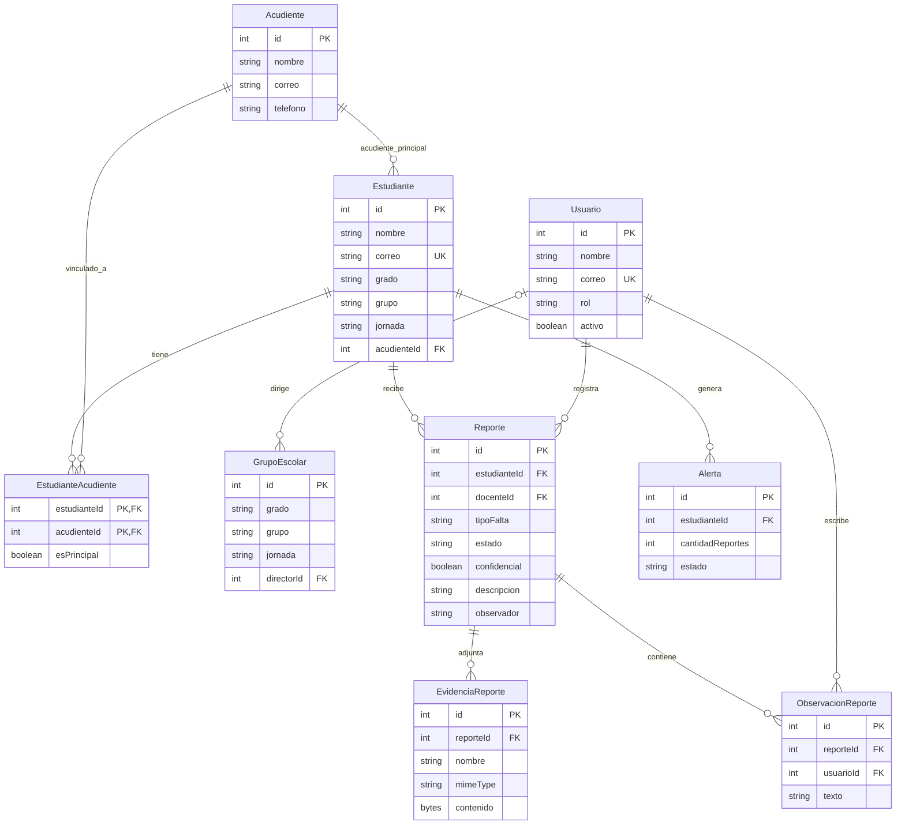
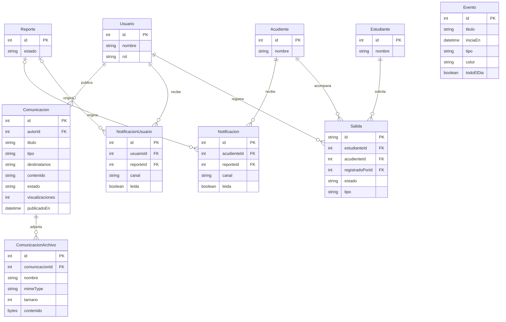
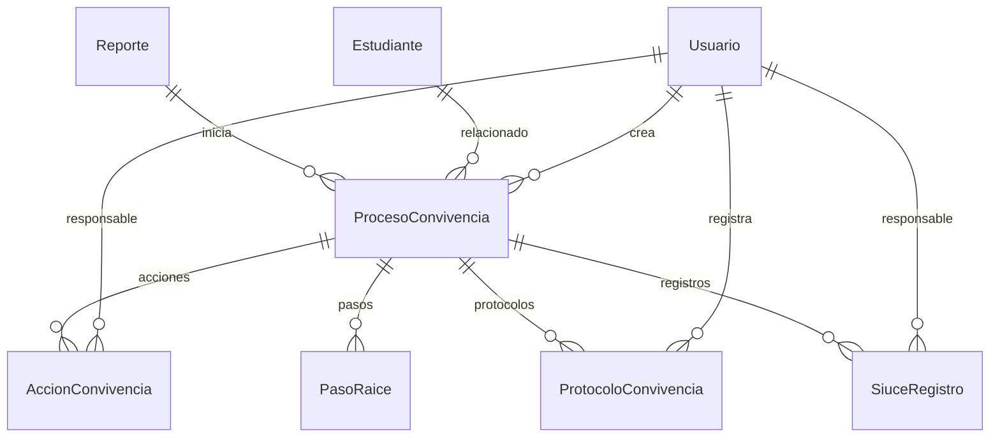

# Esquema de base de datos de SIGDE

**Fuente:** `database/prisma/schema.prisma`, migraciones y tablas verificadas en Turso/SQLite.
**Corte de datos para exposición:** 28 de septiembre de 2026.

SIGDE organiza sus datos en cinco áreas: personas y grupos, reportes y convivencia, comunicaciones, salidas y calendario, y seguridad. Las relaciones dibujadas con líneas corresponden a claves foráneas reales. Al final se indican asociaciones por texto que no son claves foráneas.

## 1. Personas, grupos y seguimiento

**Nota:** `Estudiante.grado` y `Estudiante.grupo` se corresponden con `GrupoEscolar.grado` y `GrupoEscolar.grupo`, pero **no existe una clave foránea** entre esas tablas. `EstudianteAcudiente` permite varios acudientes vinculados, además del `acudienteId` principal del estudiante.

## 2. Comunicaciones, salidas y calendario

`Evento` es una tabla independiente. El campo `destinatarios` de `Comunicacion` guarda una categoría o grupo como texto; **no es una relación con usuarios o estudiantes ni envía notificaciones por sí solo**.

## 3. Seguridad y registros complementarios

| Tabla | Clave principal | Función |
|---|---|---|
| `AuditLog` | `id` | Registro de acciones; `usuarioId` es una clave foránea opcional a `Usuario`. |
| `AuthRateLimit` | `clave` | Control de intentos de autenticación. |
| `ConfiguracionSistema` | `clave` | Parámetros del sistema. |
| `ConvivenciaReporte` | `id` | Registro específico de convivencia. Guarda `estudianteId` como texto, sin clave foránea. |

## 4. Tablas históricas presentes en la base física

La base Turso también conserva tablas que **no aparecen en el esquema Prisma actual ni tienen referencias en el código vigente**. Se documentan para no confundirlas con las funciones actuales:

Otras tablas sin claves foráneas declaradas: `AlertaIa`, `NotificacionAcudiente`, `SalidaEstudiante` y `Estudiante_legacy_20260604001138`. La tabla `_prisma_migrations` registra migraciones técnicas.

## 5. Cifras para la exposición

| Dato | Cantidad |
|---|---:|
| Estudiantes registrados | 564 |
| Grupos escolares | 28 |
| Grupos con director asignado | 8 |
| Grupos pendientes de director | 20 |
| Comunicaciones publicadas | 5 |
| Eventos registrados | 2 |

**Lectura rápida:** un estudiante pertenece a un grado y grupo, tiene acudientes vinculados y puede tener reportes, alertas y salidas. Un usuario registra reportes, dirige grupos o publica comunicaciones según su rol. Los reportes pueden incluir observaciones y evidencias; las comunicaciones pueden incluir archivos adjuntos.
